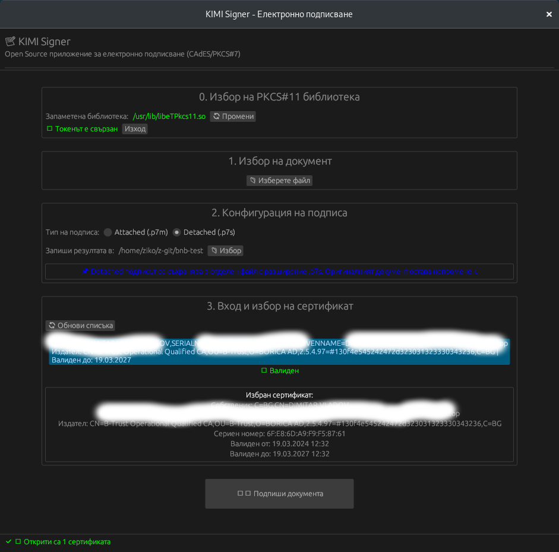

# 📝 KIMI Signer

**Open Source Desktop Application for Electronic Document Signing**



KIMI Signer е безплатно приложение с отворен код за електронно подписване на документи с квалифициран електронен подпис (КЕП). Поддържа CAdES-BES формат според европейския стандарт ETSI TS 101 733.

[](https://opensource.org/licenses/MIT)
[](https://www.rust-lang.org/)
[]()

## 📋 Съдържание

- [Възможности](#възможности)
- [Поддържани токени](#поддържани-токени)
- [Изисквания](#изисквания)
- [Инсталация](#инсталация)
- [Използване](#използване)
- [Ръчно избиране на PKCS#11 библиотека](#ръчно-избиране-на-pkcs11-библиотека)
- [ETSI Валидация](#etsi-валидация)
- [Техническа информация](#техническа-информация)
- [Отстраняване на проблеми](#отстраняване-на-проблеми)
- [Лиценз](#лиценз)

## ✨ Възможности

### 🔐 Подписване
- **CAdES-BES** формат според ETSI TS 101 733
- **Attached подпис** (.p7m) - подписът е вграден в документа
- **Detached подпис** (.p7s) - подписът е в отделен файл
- **PAdES** подпис (.pdf) - вграден в PDF подпис с визуален печат
- **SHA-256** хеширане
- Поддръжка на **RSA** ключове
- **OCSP** вграждане за време на подписване

### 🖥️ Потребителски интерфейс
- Интуитивен графичен интерфейс (GUI) с egui
- Лесен избор на PKCS#11 библиотека
- Запомняне на настройки
- Статус бар с информация
- **Безопасно зареждане** - ръчно зареждане на библиотеката за предотвратяване на блокиране на PIN

### 🔧 Конфигурация
- Автоматично откриване на PKCS#11 библиотеки
- Ръчно добавяне на библиотеки
- Запомняне на последно използвана библиотека
- Избор на изходна директория

## 🔌 Поддържани токени

### Български КЕП провайдъри
| Провайдър | Windows | Linux | macOS |
|-----------|---------|-------|-------|
| **B-Trust** | `btrustpkcs11.dll` | `libbtrustpkcs11.so` | `libbtrustpkcs11.dylib` |
| **InfoNotary** | `innp11.dll` | `libinnp11.so` | `libinnp11.dylib` |
| **StampIT** | `STAMPP11.dll` | `libstampp11.so` | `libstampp11.dylib` |
| **Bit4ID** | `bit4ipki.dll` | `libbit4ipki.so` | - |

### Международни токени
| Производител | Библиотека |
|--------------|------------|
| **Gemalto** (IDPrime) | `eTPKCS11.dll` / `libeTPkcs11.so` |
| **SafeNet** (eToken) | `eTPKCS11.dll` / `libeTPkcs11.so` |
| **ActivIdentity** | `acpkcs211.dll` |
| **OpenSC** | `opensc-pkcs11.so` |

## 💻 Изисквания

### Общи
- USB порт за токена/смарт картата
- Инсталиран драйвър за токена

### Windows
- Windows 10 или по-нова
- Visual C++ Redistributable (ако не е инсталиран)

### Linux
- GTK3 или по-нова
- OpenGL драйвъри
- Драйвър за смарт карта четец

```bash
# Debian/Ubuntu
sudo apt-get install libssl-dev pkg-config libgtk-3-0

# Fedora/RHEL
sudo dnf install openssl-devel pkgconfig gtk3
```

### macOS
- macOS 10.15 (Catalina) или по-нова
- Xcode Command Line Tools

## 🚀 Инсталация

### От изходен код

```bash
# Клониране на репозиторито
git clone https://github.com/katehonz/kimi-signer.git
cd kimi-signer

# Компилиране в release режим
cargo build --release

# Стартиране
./target/release/kimi-signer
```

### Бинарни файлове

| Платформа | Линк за изтегляне |
|-----------|-------------------|
| **Debian 12-13** | [⬇️ Изтегли](https://s3.g.s4.mega.io/smxakyb2sjkiwg33zjlylnnr4wtfvugvzvqkz/cyberbuch/drugi/kimi-signer) (обновен: 06.04.2026) |

Изтеглете последната версия от [Releases](https://github.com/katehonz/kimi-signer/releases) страницата.

## 📖 Използване

### 1️⃣ Избор на PKCS#11 библиотека

При първо стартиране:
1. Натиснете **"📁 Избери библиотека"**
2. Изберете вашия токен от списъка с автоматично открити библиотеки
3. Или посочете ръчно пътя до библиотеката

При следващо стартиране:
1. Библиотеката е запаметена, но **НЕ се зарежда автоматично**
2. Натиснете **"🔄 Зареди библиотеката"** за да се свържете с токена

> 💡 **Важно:** Библиотеката се запаметява, но се зарежда ръчно за предотвратяване на блокиране на PIN при стартиране.

### 2️⃣ Вход в токена

1. Поставете токена в USB порта
2. Натиснете **"🔄 Зареди библиотеката"** (ако все още не сте)
3. Въведете **ПИН кода** в полето
4. Натиснете **"Вход"**

### 3️⃣ Избор на документ

1. Натиснете **"📁 Изберете файл"**
2. Изберете документа за подписване
3. Поддържат се всички файлови формати

> 💡 **Автоматично разпознаване:** При избор на PDF файл, автоматично се избира **PAdES** подпис.

### 4️⃣ Конфигурация на подписа

- **Attached (.p7m)**: Подписът е вграден в документа. Оригиналният файл е вътре.
- **Detached (.p7s)**: Подписът е в отделен файл. Оригиналът остава непроменен.
- **PAdES (.pdf)**: Подписът е вграден директно в PDF файла. Разширението остава `.pdf`. В долния ляв ъгъл се поставя визуален печат с име на подписващия и дата/час.

Изберете **изходна директория** или оставете по подразбиране (същата папка).

### 5️⃣ Избор на сертификат

1. Натиснете **"🔄 Обнови списъка"**
2. Изберете сертификата за подписване от списъка
3. Проверете валидността на сертификата

### 6️⃣ Подписване

1. Натиснете **"✍️ Подпиши документа"**
2. Потвърдете с ПИН код (ако се изисква)
3. Готово! Файлът е подписан.

## 🔧 Ръчно избиране на PKCS#11 библиотека

### Windows

Обикновени пътища за библиотеки:
```
C:\Windows\System32\eTPKCS11.dll          (Gemalto/SafeNet)
C:\Windows\System32\btrustpkcs11.dll      (B-Trust)
C:\Windows\System32\innp11.dll            (InfoNotary)
C:\Windows\System32\STAMPP11.dll          (StampIT)
```

За 32-битови системи, проверете `C:\Windows\SysWOW64\`

### Linux

```bash
# Намиране на библиотеки
sudo find /usr -name "*.so" | grep -i pkcs
sudo find /usr -name "*p11*" -o -name "*pkcs11*"

# Обикновени места
/usr/lib/libeTPkcs11.so         (Gemalto)
/usr/lib64/libeTPkcs11.so       (Gemalto x64)
/usr/lib/opensc-pkcs11.so       (OpenSC)
```

### macOS

```
/usr/local/lib/libeTPkcs11.dylib
/usr/local/lib/opensc-pkcs11.so
```

## ✅ ETSI Валидация

Подписите, създадени с KIMI Signer, са валидирани с **EU DSS (Digital Signature Service)** и отговарят на стандартите:

- ✅ **ETSI TS 101 733** - CAdES-BES формат
- ✅ **ETSI EN 319 102-1** - Signature validation
- ✅ **QESig** - Qualified Electronic Signature

### Тестови резултати

Вижте `test-result/` директорията за детайлни отчети:
- `DSS-ETSI-Report.xml` - ETSI валидационен отчет
- `DSS-Detailed-report.pdf` - Подробен PDF отчет

**Всички проверки:** PASSED ✅
- Format Checking
- Identification of Signing Certificate
- Cryptographic Verification
- Signature Acceptance Validation
- X.509 Certificate Validation

## 📄 PAdES Тестване с Okular (Linux)

Подписът на PDF документи (PAdES) е тестван успешно с **Okular** - свободен PDF четец за Linux.

### Стъпки за тестване:

1. **Подпишете PDF** с KIMI Signer (изберете PDF файл → автоматично се избира PAdES)
2. **Отворете подписания файл** с Okular: `okular document_signed.pdf`
3. **Проверете подписа:** 
   - Okular показва син печат (валиден подпис)
   - Кликнете върху печата за детайли

### Очакван резултат:

```
Signatures status: 1 valid signature, out of 1
```
- Син печат в долния ляв ъгъл
- Име на подписващия
- Дата и час на подписване
- Статус: "Digitally Signed" ✅

## 🛠️ Техническа информация

### Архитектура

```
kimi-signer/
├── src/
│   ├── app.rs              # Главно GUI приложение (egui)
│   ├── crypto/
│   │   ├── pkcs11.rs       # PKCS#11 интерфейс (cryptoki)
│   │   ├── cms_builder.rs  # CMS SignedData builder (ASN.1 DER)
│   │   ├── cades.rs        # CAdES подписване
│   │   ├── pades.rs        # PAdES подписване за PDF
│   │   └── certificate.rs  # Работа с X.509 сертификати
│   ├── models/             # Модели и типове данни
│   └── utils/              # Конфигурация и помощни функции
```

### Технологичен стек

| Компонент | Технология |
|-----------|-----------|
| Език | Rust 1.93.0 |
| GUI | egui 0.28 |
| PKCS#11 | cryptoki 0.7 |
| Криптография | OpenSSL |
| Сертификати | x509-cert |
| PDF | lopdf 0.34 |

### Стандарти

- **CAdES-BES**: ETSI TS 101 733
- **PAdES-BES**: ETSI TS 102 778 (PDF подпис)
- **CMS/PKCS#7**: RFC 5652
- **X.509**: RFC 5280
- **PKCS#11**: OASIS PKCS#11 v2.40

## 🔍 Отстраняване на проблеми

### "Не е открита библиотека"
- Проверете дали драйверът на токена е инсталиран
- Опитайте ръчно да посочите пътя до .dll/.so файла
- Рестартирайте приложението след инсталация на драйвър

### "Грешен ПИН" или "Токенът е блокиран"
- Уверете се, че сте натиснали **"🔄 Зареди библиотеката"** преди да въведете ПИН
- Уверете се, че използвате правилния ПИН код за токена
- Проверете дали токенът не е заключен след многократни грешни опити
- Ако токенът е заключен, извадете го и го поставете отново

### "Не е намерен сертификат"
- Уверете се, че сте влезли с ПИН кода
- Проверете дали токенът съдържа валиден сертификат
- Обновете списъка със сертификати

### "Грешка при подписване"
- Проверете дали имате права за писане в изходната директория
- Уверете се, че сертификатът е валиден и не е изтекъл
- Проверете дали токенът поддържа RSA подписване

### Конфигурационен файл

Настройките се съхраняват в:
- **Windows**: `%APPDATA%\desktop-signer\config.toml`
- **Linux**: `~/.config/desktop-signer/config.toml`
- **macOS**: `~/Library/Application Support/desktop-signer/config.toml`

## 🤝 Принос

Приносите са добре дошли! Моля, вижте [CONTRIBUTING.md](CONTRIBUTING.md) за насоки.

### Докладване на бъгове

Моля, използвайте [GitHub Issues](https://github.com/katehonz/kimi-signer/issues) за докладване на бъгове или предложения за нови функции.

## 📄 Лиценз

Този проект е лицензиран под [MIT License](LICENSE).

```
MIT License

Copyright (c) 2024 KIMI Signer Contributors

Permission is hereby granted, free of charge, to any person obtaining a copy
of this software and associated documentation files (the "Software"), to deal
in the Software without restriction, including without limitation the rights
to use, copy, modify, merge, publish, distribute, sublicense, and/or sell
copies of the Software, and to permit persons to whom the Software is
furnished to do so, subject to the following conditions:

The above copyright notice and this permission notice shall be included in all
copies or substantial portions of the Software.
```

## 🙏 Благодарности

- [egui](https://github.com/emilk/egui) - Лек и бърз GUI framework
- [cryptoki](https://github.com/parallaxsecond/rust-cryptoki) - Rust PKCS#11 bindings
- [OpenSSL](https://www.openssl.org/) - Криптографска библиотека
- [EU DSS](https://github.com/esig/dss) - ETSI валидация
- Всички приносители към проекта

## 📞 Контакти

- GitHub: [https://github.com/katehonz/kimi-signer](https://github.com/katehonz/kimi-signer)

---

**⚠️ Внимание:** Това е приложение с отворен код. Използвайте го на свой собствен риск. Винаги правете резервно копие на важни документи преди подписване.
